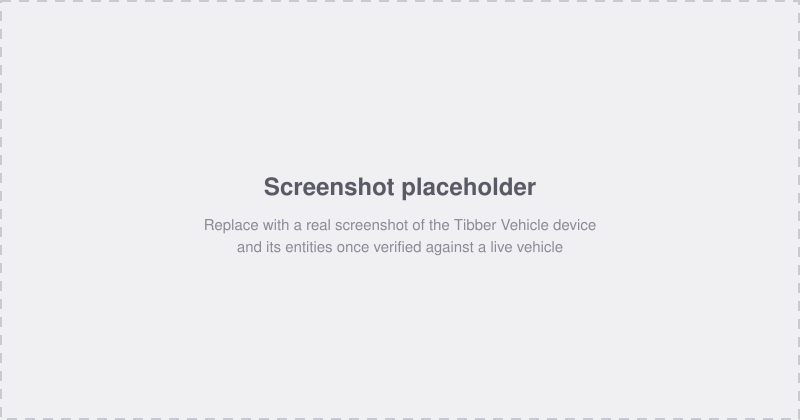

# Tibber Vehicle

[][hacs-repo]
[][releases]
[][validate]
[][license]
<!-- Sourced from Home Assistant's own opt-in analytics (https://analytics.home-assistant.io/custom_integrations.json),
     rendered live by shields.io's dynamic JSON badge. Will show 0/invalid until other users install this and have
     Settings > System > Analytics enabled on their own instance - that's expected for a newly-public repo, not a bug. -->

Reads your EV's battery level, range, and charging/plug status into Home
Assistant via the official [Tibber Data API][tibber-data-api] — for every
vehicle paired inside your Tibber account, regardless of make.

**Note:** This integration depends entirely on the Tibber Data API. It only
works for vehicles already paired inside the Tibber app, and it exposes
exactly the five values Tibber's API makes available for vehicles —
nothing more (no doors, climate, position, or lock control; see
[Known Issues / Limitations](#known-issues--limitations)).

_Placeholder illustration — will be replaced with a real screenshot once
more installs have confirmed this works across different vehicles._

## Prerequisites

1. **A Tibber account.** The free tier is sufficient — no energy contract
   required.
1. **At least one vehicle already paired inside the Tibber app.** This
   integration only reads vehicles Tibber itself already knows about;
   pairing happens entirely in Tibber's own app, not here.
1. **An OAuth2 client registered with Tibber** (one-time, free):
   1. Go to the [Tibber client registration page][tibber-clients] and log
      in with your Tibber account.
   1. Create a new client. Give it a recognizable name, e.g. `Home
      Assistant - Tibber Vehicle` — this is the name **Tibber's own consent
      screen shows you** later, not something Home Assistant ever displays.
   1. Under scopes, select at least `data-api-homes-read` and
      `data-api-vehicles-read`.
   1. Set the redirect URI to exactly
      **`https://my.home-assistant.io/redirect/oauth`** — not your own
      instance's address, even if it's LAN-only with no public URL. This is
      Home Assistant's standard shared redirect page for OAuth2 account
      linking, and it works regardless of whether your instance is
      reachable from the internet. Full mechanism traced from HA's own
      source code in [`docs/DECISIONS.md`](docs/DECISIONS.md).
   1. Note down the **client ID and secret** shown after creation — the
      secret is only displayed once.
1. **Home Assistant** with [HACS][hacs] installed, version 2024.1.0 or
   newer.

## Installation

### HACS

Installation through [HACS][hacs] is the preferred method.

[![Open the Tibber Vehicle integration in HACS.][hacs-badge]][hacs-open]

1. Click the button above, or go to HACS → Integrations → search for
   "Tibber Vehicle" → select it.
1. Press **Download**.
1. **Restart Home Assistant**, then continue to [Setup](#setup) — a fresh
   install only becomes fully known to HA (selectable anywhere in its UI)
   after a restart.

### Manual

1. Download this repository (e.g. the [latest release][releases] or the
   `main` branch as a zip).
1. Copy `custom_components/tibber_vehicle` into your Home Assistant
   configuration's `custom_components/` directory.
1. **Restart Home Assistant**, then continue to [Setup](#setup).

## Setup

### 1. Add the Application Credential

Settings → Devices & Services → **Application Credentials** ("OAuth
Anmeldedaten" in the German UI) → Add application credential → select
**Tibber Vehicle** → enter the client ID and secret from the
[Prerequisites](#prerequisites) step. The optional "Name" field here is
purely local to Home Assistant (only shown back to you if you ever add a
second Tibber credential and need to tell them apart) — never sent to
Tibber. Something like `Tibber Vehicle` is a fine choice.

This has to happen *after* installation, not before — the integration
dropdown here only lists domains HA currently has installed and loaded, so
"Tibber Vehicle" isn't selectable until the HACS/manual install (+
restart) has completed.

### 2. Add the integration

[][config-flow-start]

Click the button above, or go to Settings → Devices & Services → Add
Integration → **Tibber Vehicle**. Either way, this picks up the credential
from step 1 and takes you straight to the OAuth2 consent screen in your
browser.

1. Log in with your **Tibber account** if prompted.
1. Review and approve the requested scopes.
1. You'll be redirected back to Home Assistant, which adds **every vehicle
   currently paired to that Tibber account** at once — each as its own
   device, no picker step, no need to repeat the login per vehicle. A
   vehicle paired in Tibber *after* this step won't appear until you
   reload the integration (Settings → Devices & Services → Tibber Vehicle
   → ⋮ → Reload).

## Entities

One Home Assistant device per paired vehicle, with 5 entities each — the
*complete* data surface the Tibber Data API offers for vehicles, confirmed
by direct inspection of its OpenAPI schema. Names, icons, units, and
device classes are matched to the equivalent entity in
[`robinostlund/homeassistant-volkswagencarnet`][volkswagencarnet] wherever
that makes sense, so switching between the two — or running both side by
side — shows consistent entity identity. Full comparison and reasoning in
[`docs/DECISIONS.md`](docs/DECISIONS.md).

- [`sensor.<vehicle_name>_battery_level`](#sensorvehicle_name_battery_level)
- [`sensor.<vehicle_name>_battery_target_charge_level`](#sensorvehicle_name_battery_target_charge_level)
- [`sensor.<vehicle_name>_electric_range`](#sensorvehicle_name_electric_range)
- [`sensor.<vehicle_name>_plug_status`](#sensorvehicle_name_plug_status)
- [`sensor.<vehicle_name>_charging_state`](#sensorvehicle_name_charging_state)

All entities update every 5 minutes (Tibber's API documents no shorter
recommended cadence — see [`docs/DECISIONS.md`](docs/DECISIONS.md) for why
polling faster wouldn't gain anything). None require any permission beyond
the two scopes selected in [Prerequisites](#prerequisites).

### `sensor.<vehicle_name>_battery_level`

The vehicle's current state of charge, as a percentage.

Tibber capability: `storage.stateOfCharge`  
Unit / device class: `%`, `battery`, measurement

### `sensor.<vehicle_name>_battery_target_charge_level`

The charge level the vehicle is set to stop charging at, as a percentage.

Tibber capability: `storage.targetStateOfCharge`  
Unit / device class: `%`, `battery`

### `sensor.<vehicle_name>_electric_range`

Estimated remaining driving range on the current charge.

Tibber capability: `range.remaining`  
Unit / device class: `km` (converted from the API's meters), `distance`,
measurement

### `sensor.<vehicle_name>_plug_status`

Whether a charging cable is plugged in.

Possible values: `connected`, `disconnected`, `unknown`

Tibber capability: `connector.status`

_Stays a plain sensor here rather than a `binary_sensor` (unlike VW
Connect's equivalent) so all three values stay directly visible — see
`docs/DECISIONS.md`._

### `sensor.<vehicle_name>_charging_state`

Whether the vehicle is actively charging.

Possible values: `charging`, `idle`, `unknown`

Tibber capability: `charging.status`

## Removal

Settings → Devices & Services → **Tibber Vehicle** → ⋮ → Delete. This
removes all of that account's vehicle devices and entities from Home
Assistant, and revokes the stored OAuth2 tokens' local copy — it does
**not** revoke the OAuth2 client itself at Tibber. To fully undo the
one-time setup from [Prerequisites](#prerequisites), also delete the
client at the [Tibber client registration page][tibber-clients]. If you
installed via HACS and want to remove the integration's files too,
uninstall it from there afterwards.

## Known Issues / Limitations

- **Read-only.** The Tibber Data API exposes no control endpoints for
  vehicles — there is no way to start/stop charging or lock/unlock from
  this integration, regardless of what your car itself supports.
- **No automatic reauthentication.** If Tibber revokes or expires your
  refresh token outside the normal OAuth2 refresh cycle, you'll need to
  remove and re-add the integration rather than being prompted to
  re-authenticate in place.
- **Newly-paired vehicles need a manual reload.** A vehicle paired in
  Tibber after the integration was set up won't appear until you reload
  it (see [Setup](#setup)).
- **Data freshness depends on Tibber, not just this integration.** Tibber
  itself polls the vehicle manufacturer's backend on its own schedule
  (undocumented); this integration's own 5-minute polling can't return
  fresher data than Tibber's own backend already has.

## Support / Issues

Please report any issues you find with this integration on the
[GitHub Issues page][issues].

## Development

See [`docs/DEVELOPMENT.md`](docs/DEVELOPMENT.md) for the dev/test workflow
(local repo → disposable Dockerized HA instance for fast iteration →
`pytest-homeassistant-custom-component` for unit tests → releasing a change
to the real instance) and [`CONTRIBUTING.md`](CONTRIBUTING.md) if you want
to contribute.

Background on why this project exists and how it relates to sibling
projects is in [`docs/CONTEXT.md`](docs/CONTEXT.md).

## License

MIT — see [`LICENSE`][license].

[hacs]: https://hacs.xyz/
[hacs-repo]: https://github.com/hacs/integration
[hacs-badge]: https://my.home-assistant.io/badges/hacs_repository.svg
[hacs-open]: https://my.home-assistant.io/redirect/hacs_repository/?owner=Smengerl&repository=ha-tibber-vehicle&category=integration
[config-flow-start]: https://my.home-assistant.io/redirect/config_flow_start/?domain=tibber_vehicle
[releases]: https://github.com/Smengerl/ha-tibber-vehicle/releases
[validate]: https://github.com/Smengerl/ha-tibber-vehicle/actions/workflows/validate.yml
[license]: LICENSE
[issues]: https://github.com/Smengerl/ha-tibber-vehicle/issues
[tibber-data-api]: https://data-api.tibber.com
[tibber-clients]: https://data-api.tibber.com/clients/manage/
[volkswagencarnet]: https://github.com/robinostlund/homeassistant-volkswagencarnet
